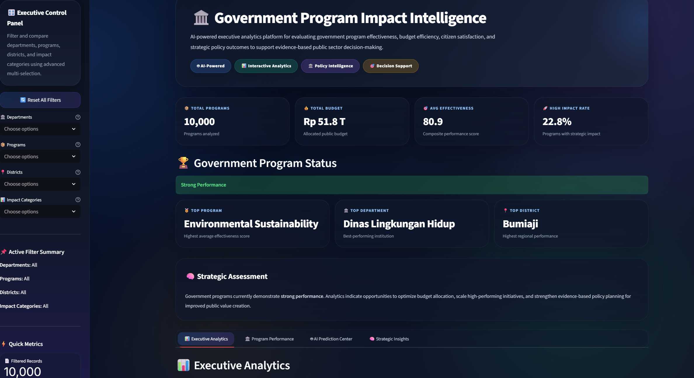
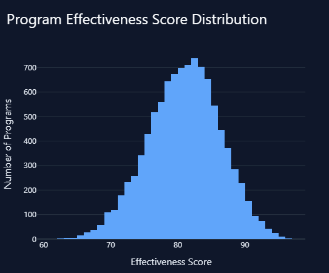
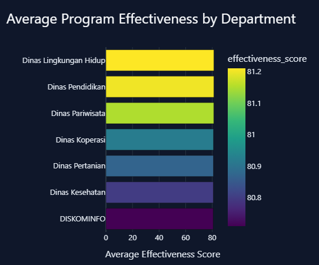
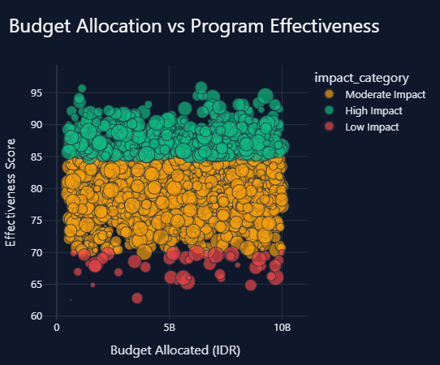

<div align="center">

# 🏛️ Government Program Impact Intelligence

### AI-Powered Program Effectiveness Evaluation, Budget Efficiency Analytics, and Executive Decision Support Dashboard


### 🟢 Core Project | Internship Project (DISKOMINFO Kota Batu) | 2025

🔗 **Live Demo:** https://mwildannabila-core-government-program-impact-analysis.streamlit.app/

</div>

---

# 🖥️ Dashboard Preview



> Premium executive dashboard for evaluating government program effectiveness, measuring budget efficiency, predicting program impact, and generating AI-powered strategic recommendations.

---

# 🧠 Project Overview

This project develops an end-to-end **Machine Learning** and **Business Intelligence** platform to evaluate the effectiveness of government programs using data-driven performance indicators.

The system analyzes program outcomes, budget allocation, citizen satisfaction, and operational metrics to classify program impact levels, predict effectiveness scores, and generate strategic recommendations for policymakers.

This project was developed as a **Core Experience Project** during an internship at **Dinas Komunikasi dan Informatika Kota Batu (DISKOMINFO Kota Batu)** and demonstrates how analytics and artificial intelligence can support evidence-based policymaking.

---

# 🎯 Business Problem

Government institutions allocate substantial public budgets across multiple programs and strategic initiatives. However, decision-makers often face challenges in determining:

- Which programs generate the highest social impact
- Whether budget allocations are being used efficiently
- Which departments perform most effectively
- Which districts achieve the best outcomes
- How to prioritize future investments

This project addresses these challenges by transforming program data into an AI-powered executive intelligence platform.

---

# 🎯 Project Objectives

- Evaluate government program effectiveness using quantitative indicators
- Measure budget efficiency and return on investment (ROI)
- Analyze citizen satisfaction and service outcomes
- Classify programs into impact categories
- Predict effectiveness scores for new program scenarios
- Generate AI-powered strategic recommendations
- Deploy an interactive executive dashboard using Streamlit

---

# 🗂️ Dataset Overview

| Attribute | Value |
|----------|-------|
| Dataset Type | Synthetic Government Program Dataset |
| Total Records | 10,000 programs |
| Departments | Multi-department government institutions |
| Districts | Multiple regional districts |
| Impact Categories | Low Impact, Moderate Impact, High Impact |
| Budget Range | Rp 500 Million – Rp 10 Billion |
| Key Metrics | Effectiveness, ROI, Satisfaction, Budget Utilization |

---

# 🧪 Methodology

```text
Synthetic Data Generation
        ↓
Data Cleaning & Feature Engineering
        ↓
Exploratory Data Analysis (EDA)
        ↓
Program Impact Classification
        ↓
Effectiveness Score Prediction
        ↓
AI Strategic Insight Engine
        ↓
Executive Dashboard (Streamlit)
```

---

# 📈 Model Performance

| Task | Best Model | Performance |
|------|-----------|------------:|
| Impact Category Classification | Random Forest Classifier | F1 Score: 0.993 |
| Effectiveness Score Prediction | Linear Regression | R² Score: -0.006* |

> *The regression result indicates that synthetic relationships in this dataset are largely deterministic through engineered metrics; the primary emphasis of this project is on the end-to-end analytical workflow and executive decision support system.*

---

# ✨ Key Features

- 🤖 AI-based impact category prediction
- 🎯 Effectiveness score forecasting
- 💰 Budget efficiency analytics
- 📊 Executive KPI dashboard
- 🏛️ Department and district benchmarking
- 🧠 AI strategic recommendations
- 📄 Structured JSON executive summary
- 🖥️ Premium interactive Streamlit dashboard

---

# 🖼️ Additional Insights

## 📊 Program Impact Distribution


## 🎯 Effectiveness Score Distribution


## 🏛️ Department Performance Ranking


## 💰 Budget Allocation vs Effectiveness


---

# 👨‍💻 My Role

This is a fully independent end-to-end project covering:

- Synthetic dataset design
- Data preprocessing and feature engineering
- Exploratory data analysis
- Machine learning model development
- KPI and business logic design
- Streamlit dashboard development
- Deployment and technical documentation

---

# 🚧 Key Challenge

**Challenge:** Government program performance is multidimensional, involving budget efficiency, completion rates, citizen satisfaction, and social reach.

**Solution:** I engineered a composite effectiveness framework and developed machine learning models to classify program impact and simulate future policy scenarios through an executive dashboard.

---

# 💼 Business Impact

This platform enables government institutions to:

- Identify high-impact programs
- Optimize public budget allocation
- Benchmark departmental performance
- Simulate future program outcomes
- Strengthen evidence-based policymaking
- Improve accountability and public value creation

---

# 🌐 Live Demo

🔗 https://mwildannabila-core-government-program-impact-analysis.streamlit.app/

---

# 🛠️ Tech Stack

- Python
- Pandas
- NumPy
- Scikit-learn
- Plotly
- Streamlit
- Joblib
- Jupyter Notebook

---

# 📁 Project Structure

```text
core-government-program-impact-analysis/
│
├── app/
│   └── app.py
├── data/
│   └── processed/
│       ├── program_impact_cleaned.csv
│       └── final_program_impact_summary.json
├── models/
│   ├── impact_classifier.pkl
│   └── effectiveness_regressor.pkl
├── notebooks/
├── assets/
│   └── dashboard-overview.png
├── requirements.txt
├── README.md
└── .gitignore
```

---

# 🚀 Installation

```bash
git clone https://github.com/yourusername/core-government-program-impact-analysis.git
cd core-government-program-impact-analysis
pip install -r requirements.txt
streamlit run app/app.py
```

---

# 🌍 Deployment

Deployed using Streamlit Community Cloud.

- **Main file path:** `app/app.py`

---

# 🎯 Career Relevance

Relevant for roles in:

- Data Analyst
- Data Scientist
- Machine Learning Engineer
- Business Intelligence Analyst
- Government Data Analyst
- AI Engineer

---

# 👨‍💻 Author

**Muhammad Wildan Nabila**  
Informatics — Universitas Muhammadiyah Malang

---

<div align="center">

### 🏛️ Transforming Government Program Data into Strategic Policy Intelligence with AI

</div>
