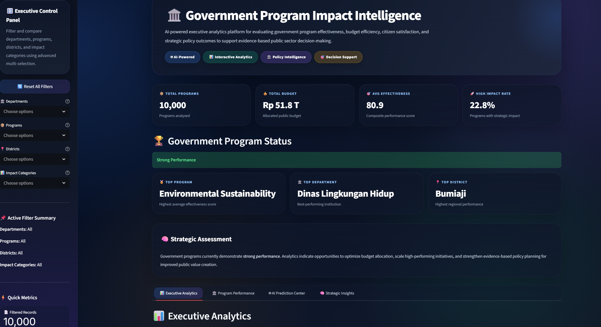
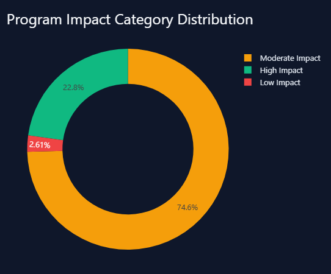
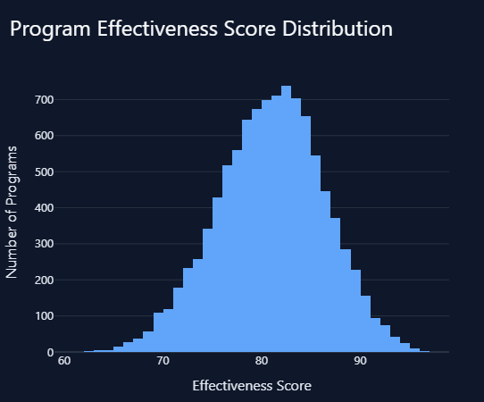
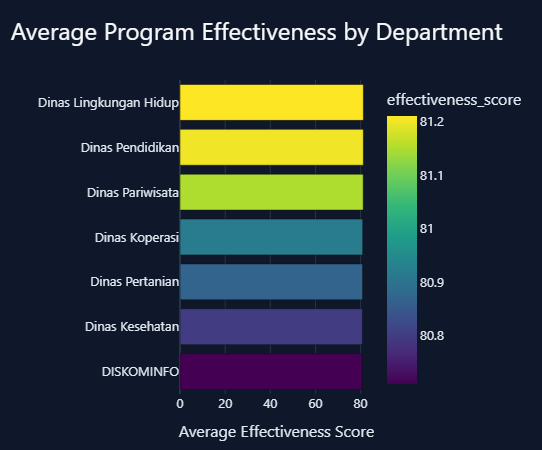
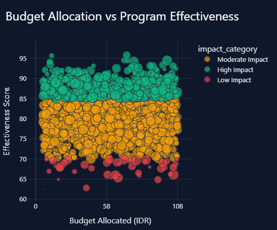
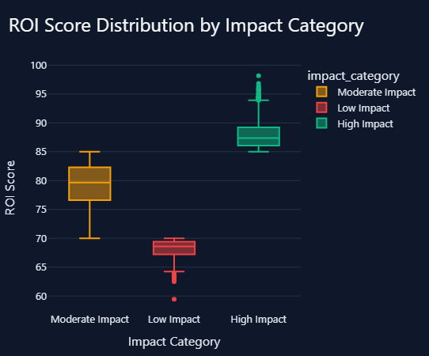
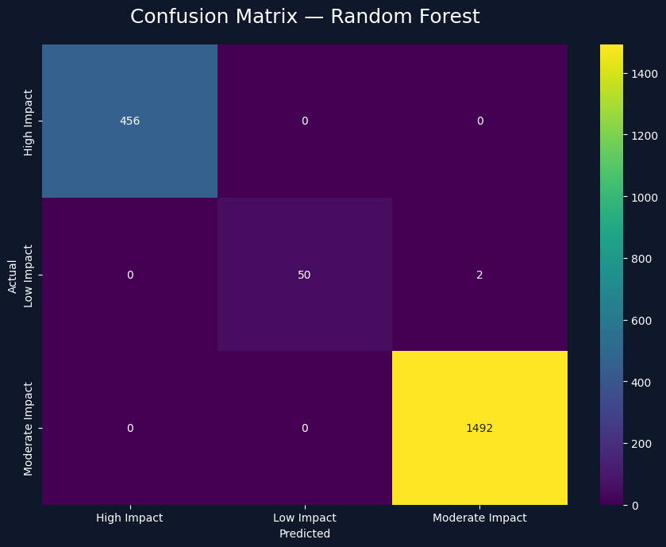
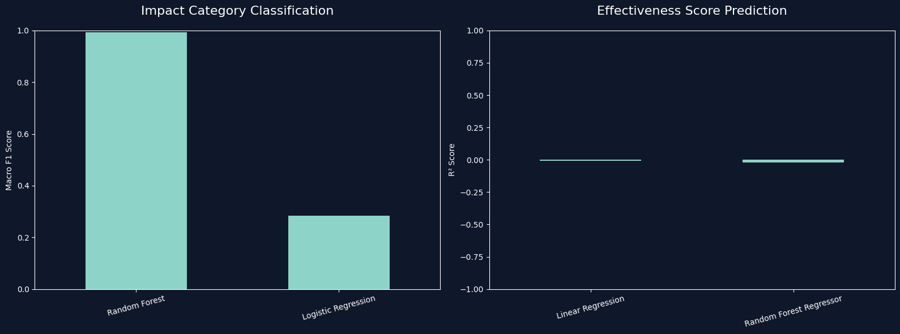

<div align="center">

# Government Program Impact Intelligence

### Program Evaluation · Budget Analytics · Public-Sector Decision Support

**Analytics Prototype for Exploring Government Program Performance**

<br>


<br>


<br><br>

**Evaluate → Compare → Diagnose → Prioritize**

<br>

[](https://mwildannabila-core-government-program-impact-analysis.streamlit.app/)

</div>

---

## Project at a Glance

<table>
<tr>
<td align="center" width="20%">
<strong>10,000</strong><br>
Synthetic Programs
</td>
<td align="center" width="20%">
<strong>F1 0.993</strong><br>
Impact Classification
</td>
<td align="center" width="20%">
<strong>R² −0.006</strong><br>
Regression Result
</td>
<td align="center" width="20%">
<strong>Multi-Dimensional</strong><br>
Program Analytics
</td>
<td align="center" width="20%">
<strong>Live</strong><br>
Streamlit Prototype
</td>
</tr>
</table>

> **Project focus:** Exploring how program outcomes, budget utilization, citizen satisfaction, and operational indicators can be transformed into interpretable public-sector performance intelligence.

> **Important:** This project uses a **synthetic dataset** and is presented as an analytics prototype. It is not an official government evaluation system, policy assessment, or deployed decision-making tool.

---

# Project Context

Public programs are multidimensional.

A program can consume substantial resources while producing different levels of completion, citizen satisfaction, social reach, and operational performance.

This creates an analytical question:

> ### How can multiple program-performance indicators be consolidated into an interpretable framework for comparing outcomes, resource utilization, and program priorities?

This project explores that question through a simulated public-sector analytics environment.

```text
Program Data
     │
     ├── Budget
     ├── Utilization
     ├── Completion
     ├── Satisfaction
     ├── Social Reach
     └── Operational Metrics
             │
             ▼
      Performance Analytics
             │
             ▼
       Decision Support
```

The emphasis is on **analytical workflow design and interpretability**, not on making claims about the effectiveness of actual government programs.

---

# Live Analytics Prototype

<div align="center">

[](https://mwildannabila-core-government-program-impact-analysis.streamlit.app/)

</div>

The deployed Streamlit prototype integrates:

`Program KPIs` · `Budget Analytics` · `Impact Segmentation` · `Department Benchmarking` · `Regional Comparison` · `Scenario Exploration`

into a unified analytical interface.

---

# Executive Dashboard

<p align="center">
  
</p>

The dashboard provides an executive-level analytical view of simulated program performance.

<table>
<tr>
<td align="center" width="25%">
<strong>Effectiveness</strong><br>
Program Outcomes
</td>
<td align="center" width="25%">
<strong>Efficiency</strong><br>
Budget & ROI
</td>
<td align="center" width="25%">
<strong>Benchmarking</strong><br>
Department & District
</td>
<td align="center" width="25%">
<strong>Impact</strong><br>
Program Segmentation
</td>
</tr>
</table>

---

# Analytical Questions

The prototype is designed to explore questions such as:

```text
Which simulated programs show stronger performance?
                        │
                        ▼
How does budget allocation relate to effectiveness?
                        │
                        ▼
How do departments and districts compare?
                        │
                        ▼
Which indicators distinguish impact categories?
                        │
                        ▼
Where should deeper evaluation be focused?
```

These questions frame the dashboard as a **decision-support prototype**, rather than an automated policy-decision system.

---

# Dataset & Analytical Scope

| Dimension | Scope |
|---|---|
| **Dataset** | Synthetic Government Program Dataset |
| **Records** | **10,000 simulated programs** |
| **Institutional structure** | Multiple simulated departments |
| **Geographic structure** | Multiple simulated districts |
| **Budget range** | Rp500 million – Rp10 billion |
| **Impact categories** | Low · Moderate · High |
| **Performance indicators** | Effectiveness · ROI · Satisfaction · Budget Utilization |
| **Purpose** | Analytics prototyping and workflow demonstration |

### Why Synthetic Data?

Synthetic data makes it possible to demonstrate an end-to-end analytical architecture without representing simulated values as actual government performance.

However, this creates an important limitation:

> **Patterns learned from synthetic data should not be interpreted as empirical evidence about real public programs.**

---

# Analytical Architecture

```text
                    SYNTHETIC PROGRAM DATA
                              │
                              ▼
                      Data Validation
                              │
                              ▼
                     Feature Engineering
                              │
                              ▼
                Exploratory Data Analysis
                              │
               ┌──────────────┼──────────────┐
               ▼              ▼              ▼
          PROGRAM KPI      BUDGET         OUTCOME
           ANALYSIS       ANALYTICS       ANALYSIS
               │              │              │
               └──────────────┼──────────────┘
                              ▼
                     IMPACT FRAMEWORK
                              │
                  ┌───────────┴───────────┐
                  ▼                       ▼
          CLASSIFICATION             REGRESSION
          Impact Category       Effectiveness Score
                  │                       │
                  └───────────┬───────────┘
                              ▼
                       MODEL REVIEW
                              │
                              ▼
                 EXECUTIVE ANALYTICS
                              │
                              ▼
                  STREAMLIT PROTOTYPE
```

A key principle of this project is that **model results are evaluated before they are translated into decision-support features**.

---

# Program Impact Framework

The analytical framework examines multiple dimensions of simulated program performance.

```text
                 PROGRAM PERFORMANCE
                         │
          ┌──────────────┼──────────────┐
          ▼              ▼              ▼
       OUTCOME        EFFICIENCY      EXPERIENCE
          │              │              │
    Completion         Budget         Citizen
    Social Reach     Utilization     Satisfaction
          │              │              │
          └──────────────┼──────────────┘
                         ▼
                 EFFECTIVENESS VIEW
                         │
                         ▼
                  IMPACT CATEGORY
```

This structure provides a simplified representation of multidimensional program evaluation for analytical prototyping.

---

# Program Impact Distribution

<p align="center">
  
</p>

Programs are grouped into:

<div align="center">


</div>

These categories represent **analytical labels within the synthetic framework**, not official assessments of government programs.

---

# Effectiveness Distribution

<p align="center">
  
</p>

The effectiveness score provides a consolidated analytical representation of multiple simulated program-performance dimensions.

Its purpose is to support comparative exploration across programs rather than act as an official policy-performance metric.

---

# Department Benchmarking

<p align="center">
  
</p>

Department-level aggregation allows simulated program outcomes to be compared across organizational groups.

Potential analytical questions include:

- Which departments show higher average effectiveness?
- How consistent is performance within each department?
- Which indicators explain observed differences?
- Where is additional diagnostic analysis warranted?

> Rankings in this project are derived entirely from synthetic data and must not be interpreted as rankings of real government institutions.

---

# Budget vs. Effectiveness

<p align="center">
  
</p>

The analysis explores whether higher simulated budget allocations consistently correspond to higher effectiveness scores.

A central analytical principle is:

<div align="center">

### Budget Size ≠ Guaranteed Effectiveness

</div>

Budget should therefore be interpreted alongside program outcomes, utilization, reach, and other relevant performance indicators rather than in isolation.

Within this project, this relationship is a property of the **synthetic dataset** and should not be generalized to real public programs.

---

# ROI & Impact Analysis

<p align="center">
  
</p>

ROI-oriented analysis provides an additional lens for examining the relationship between simulated resource allocation and program outcomes.

For public-sector contexts, this metric should be understood as a **simplified analytical construct**, since public value cannot always be reduced to conventional financial return alone.

---

# Machine Learning Evaluation

Two predictive tasks were explored.

| Task | Model | Metric | Result |
|---|---|---|---:|
| Impact Category Classification | Random Forest Classifier | F1 Score | **0.993** |
| Effectiveness Score Regression | Linear Regression | R² | **−0.006** |

These two results require very different interpretations.

---

# Classification Result

<div align="center">


</div>

The Random Forest classifier achieved an **F1 score of 0.993** on the synthetic classification task.

<p align="center">
  
</p>

This indicates near-perfect reproduction of the impact categories within the evaluated synthetic dataset.

However, unusually high predictive performance deserves additional scrutiny.

Possible explanations include:

- Strong deterministic relationships in synthetic data
- Impact labels derived from variables also supplied to the model
- Easily separable engineered categories
- Potential target leakage
- Limited noise compared with real-world administrative data

> **A high F1 score on synthetic data does not establish equivalent performance on real government program data.**

Before treating the classifier as practically validated, the label-generation logic and feature pipeline should be audited for leakage.

---

# Regression Result: A Useful Negative Finding

<div align="center">


</div>

The effectiveness-score regression produced:

### R² = −0.006

This means the evaluated Linear Regression model performed slightly worse than predicting the mean effectiveness score on the evaluated data.

Therefore, the regression model should **not** be presented as a successful effectiveness predictor.

Instead, this result is analytically useful because it demonstrates that:

```text
Building a model
      ≠
Obtaining a useful model
```

A credible machine-learning workflow includes recognizing when a model does **not** provide meaningful predictive value.

---

# Model Performance Review

<p align="center">
  
</p>

The contrasting results highlight two important lessons:

<table>
<tr>
<td width="50%" valign="top">

### Classification

**F1 = 0.993**

Excellent performance within the synthetic setup, but sufficiently high to justify checking label construction and potential leakage.

</td>
<td width="50%" valign="top">

### Regression

**R² = −0.006**

The evaluated linear model does not explain meaningful variation in the target and should not drive decision-making.

</td>
</tr>
</table>

This makes **model validation**, rather than simply model deployment, an important part of the project.

---

# From Program Data to Decision Support

```text
                   PROGRAM DATA
                        │
                        ▼
                PERFORMANCE KPIs
                        │
         ┌──────────────┼──────────────┐
         ▼              ▼              ▼
      OUTCOMES       BUDGETS       SATISFACTION
         │              │              │
         └──────────────┼──────────────┘
                        ▼
                  COMPARATIVE VIEW
                        │
            ┌───────────┼───────────┐
            ▼           ▼           ▼
        Program     Department    District
        Analysis     Benchmark     Analysis
            │           │           │
            └───────────┼───────────┘
                        ▼
                 ANALYTICAL SIGNAL
                        │
                        ▼
                  HUMAN REVIEW
                        │
                        ▼
                 DECISION SUPPORT
```

The final step intentionally remains **human review**.

Analytics can structure evidence and highlight patterns, but public-sector decisions also require institutional context, policy objectives, legal constraints, stakeholder considerations, and validated real-world data.

---

# Decision-Support Framework

| Analytical Signal | Potential Use |
|---|---|
| Lower simulated effectiveness | Identify programs for deeper review |
| High budget + weaker outcome | Investigate allocation and implementation |
| Higher satisfaction | Examine potentially transferable practices |
| Department differences | Comparative diagnostic analysis |
| District differences | Geographic performance investigation |
| High-impact category | Identify simulated high-performing patterns |
| Unusual KPI combination | Prioritize manual review |

> These are **potential analytical uses within a simulated environment**, not policy recommendations or demonstrated improvements in government performance.

---

# Key Technical Challenge

### Challenge

Program effectiveness is inherently multidimensional.

A single metric cannot fully represent:

`Budget Efficiency` · `Completion` · `Satisfaction` · `Social Reach` · `Operational Performance`

### Approach

The project constructs a simplified analytical framework that combines multiple performance dimensions and exposes them through an interactive dashboard.

The technical workflow includes:

1. Synthetic dataset generation.
2. Data validation and preprocessing.
3. KPI engineering.
4. Composite effectiveness design.
5. Exploratory analysis.
6. Impact-category modeling.
7. Regression experimentation.
8. Model evaluation and failure analysis.
9. Interactive visualization.
10. Streamlit deployment.

The inclusion of **failure analysis** is intentional: unsuccessful models provide information about the limitations of the current data and modeling assumptions.

---

# Internship Context

This project is presented as a **portfolio analytics prototype developed in the context of my 2025 internship experience at DISKOMINFO Kota Batu**.

The application itself uses a **synthetic government-program dataset** and should not be interpreted as:

- an official DISKOMINFO Kota Batu system,
- an official Pemerintah Kota Batu dashboard,
- an evaluation of actual Kota Batu programs,
- or a tool deployed for real policy decisions.

This distinction separates the professional context that motivated the project from the simulated data used to demonstrate the analytical architecture.

---

# Project Ownership

### Muhammad Wildan Nabila
**Data Science · Public-Sector Analytics**

This is an independently developed end-to-end analytics prototype covering:

- Synthetic dataset design
- Data preprocessing
- Feature engineering
- Exploratory Data Analysis
- KPI framework design
- Impact segmentation
- Classification modeling
- Regression experimentation
- Model evaluation
- Analytical interpretation
- Interactive dashboard development
- Streamlit deployment
- Technical documentation

The project demonstrates the complete workflow from **analytical problem formulation to deployed decision-support prototype**.

---

# Technology Ecosystem

<div align="center">


&nbsp;&nbsp;&nbsp;

&nbsp;&nbsp;&nbsp;

&nbsp;&nbsp;&nbsp;

&nbsp;&nbsp;&nbsp;

&nbsp;&nbsp;&nbsp;

&nbsp;&nbsp;&nbsp;


<br><br>

`Python` · `Pandas` · `NumPy` · `Scikit-learn` · `Plotly` · `Streamlit` · `Joblib`

</div>

---

# Technical Stack

| Layer | Technology |
|---|---|
| **Programming** | Python |
| **Data Processing** | Pandas · NumPy |
| **Classification** | Random Forest |
| **Regression Experiment** | Linear Regression |
| **Machine Learning** | Scikit-learn |
| **Visualization** | Plotly |
| **Application** | Streamlit |
| **Model Persistence** | Joblib |
| **Deployment** | Streamlit Community Cloud |

---

# Skills Demonstrated

<table>
<tr>
<td width="33%" valign="top">

**Data Science**

- Exploratory Data Analysis
- Feature Engineering
- Classification
- Regression Evaluation

</td>
<td width="33%" valign="top">

**Public-Sector Analytics**

- KPI Design
- Program Analytics
- Budget Analysis
- Comparative Benchmarking

</td>
<td width="33%" valign="top">

**Analytics Engineering**

- Interactive Visualization
- Streamlit Development
- Model Integration
- Cloud Deployment

</td>
</tr>
</table>

---

# Analytical Limitations

This project has several important limitations.

### 1 · Synthetic Data

All program records are simulated.

The observed relationships therefore demonstrate analytical functionality rather than empirical government-program behavior.

### 2 · Classification Performance Requires Leakage Audit

The classifier's **F1 score of 0.993** is unusually high.

If impact labels were constructed directly or indirectly from variables also available to the model, predictive performance may partially reflect the label-generation rules rather than genuine generalization.

### 3 · Regression Does Not Provide Predictive Value

The Linear Regression model produced **R² = −0.006**.

It should not be used to support effectiveness predictions in its current form.

### 4 · Composite Metrics Encode Assumptions

Any composite effectiveness or ROI framework depends on how indicators and weights are defined.

Different assumptions can produce different rankings.

### 5 · Public Value Is Multidimensional

Government-program performance cannot always be reduced to financial ROI or a single effectiveness score.

### 6 · No Causal Evaluation

The analysis does not estimate whether a program itself caused an observed outcome.

### 7 · No Real-World Policy Validation

No claim is made that the framework has been validated for actual public-sector allocation or policy decisions.

---

# Future Development

The strongest next steps would be:

- Audit the classification target for leakage
- Document the impact-label construction formula
- Introduce realistic noise into synthetic data
- Compare classification against simple baselines
- Use cross-validation
- Develop stronger regression baselines
- Investigate nonlinear regression models
- Add MAE and RMSE
- Perform sensitivity analysis on composite weights
- Add uncertainty analysis
- Integrate real anonymized/open government data
- Introduce longitudinal program evaluation
- Explore causal inference where appropriate
- Add geographic analysis
- Implement scenario analysis
- Add data-quality monitoring

A more rigorous future architecture would be:

```text
REAL / VALIDATED DATA
        │
        ▼
KPI FRAMEWORK
        │
        ▼
BASELINE ANALYSIS
        │
        ▼
MODEL VALIDATION
        │
        ├── Leakage Audit
        ├── Cross-Validation
        ├── Robustness Testing
        └── Sensitivity Analysis
        │
        ▼
HUMAN INTERPRETATION
        │
        ▼
DECISION SUPPORT
```

---

# Repository Structure

```text
core-government-program-impact-analysis/
│
├── app/
│   └── app.py
│
├── data/
│   └── processed/
│       ├── program_impact_cleaned.csv
│       └── final_program_impact_summary.json
│
├── models/
│   ├── impact_classifier.pkl
│   └── effectiveness_regressor.pkl
│
├── notebooks/
│
├── assets/
│   ├── dashboard-overview.png
│   ├── impact-category-distribution.png
│   ├── effectiveness-score-distribution.png
│   ├── department-performance-ranking.png
│   ├── budget-vs-effectiveness.png
│   ├── roi-score-distribution.png
│   ├── model-performance-comparison.png
│   └── impact-confusion-matrix.png
│
├── requirements.txt
├── README.md
└── .gitignore
```

---

# Run Locally

```bash
git clone <repository-url>
cd core-government-program-impact-analysis

pip install -r requirements.txt
streamlit run app/app.py
```

---

# Project Summary

| Dimension | Implementation |
|---|---|
| **Problem** | Government program performance analytics |
| **Dataset** | **10,000 synthetic program records** |
| **Primary Analysis** | Effectiveness · Budget · ROI · Satisfaction |
| **Classification** | Random Forest |
| **Classification F1** | **0.993 — requires leakage review** |
| **Regression** | Linear Regression |
| **Regression R²** | **−0.006 — not predictively useful** |
| **Visualization** | Plotly |
| **Application** | Streamlit |
| **Deployment** | **Live Prototype** |
| **Primary Value** | Analytics Workflow & Decision-Support Demonstration |

---

# Explore the Prototype

<div align="center">

[](https://mwildannabila-core-government-program-impact-analysis.streamlit.app/)

</div>

---

# Author

**Muhammad Wildan Nabila**  
Bachelor of Informatics · Universitas Muhammadiyah Malang

<div align="left">


</div>

---

<div align="center">

### Program Data → Performance Evidence → Comparative Analytics → Decision Support

**Public-Sector Analytics · Machine Learning · Interactive BI · Responsible Evaluation**

</div>
